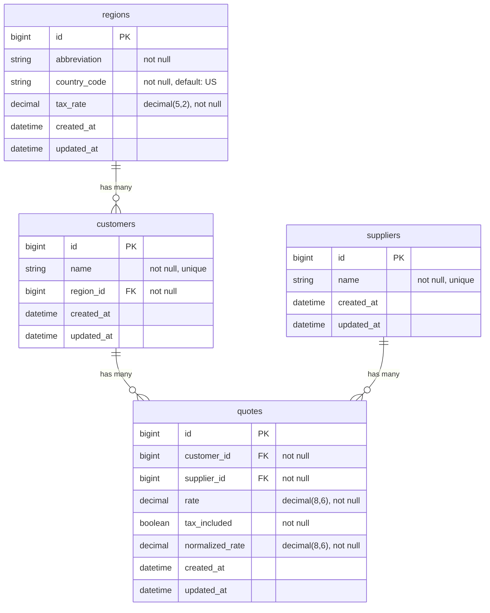

# DataHound — Entity Relationship Diagram

## Constraints

| Table | Constraint | Type |
|-------|-----------|------|
| regions | `[abbreviation, country_code]` | Composite unique index |
| customers | `name` | Unique index |
| customers | `region_id → regions.id` | Foreign key |
| suppliers | `name` | Unique index |
| quotes | `[customer_id, supplier_id]` | Composite unique index |
| quotes | `customer_id → customers.id` | Foreign key |
| quotes | `supplier_id → suppliers.id` | Foreign key |

## Normalization Notes

- **3NF**: `tax_rate` lives on `regions`, not `customers`, eliminating the transitive dependency (customer → region → tax_rate)
- **`normalized_rate`**: Pre-tax rate computed on import. For tax-included quotes: `rate / (1 + tax_rate / 100.0)`. For tax-excluded: `rate` as-is. Enables apples-to-apples comparison across all quotes.
- **`country_code`**: ISO 3166-1 alpha-2. Ensures region abbreviations are unambiguous across countries.
